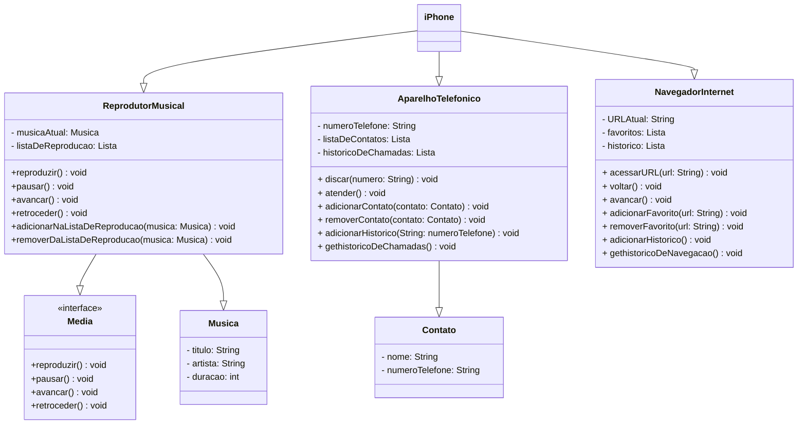

## POO - Desafio

### Modelagem e Diagramação de um Componente iPhone

Neste desafio, fui responsável por modelar e diagramar a representação UML do componente iPhone, abrangendo suas funcionalidades como Reprodutor Musical, Aparelho Telefônico e Navegador na Internet, tendo como base o vídeo de lançamento do iPhone de 2007. Em seguida, implementando as classes e interfaces basicos no formato de arquivos .java.

[Lançamento iPhone 2007](https://www.youtube.com/watch?v=9ou608QQRq8&t=130s)

