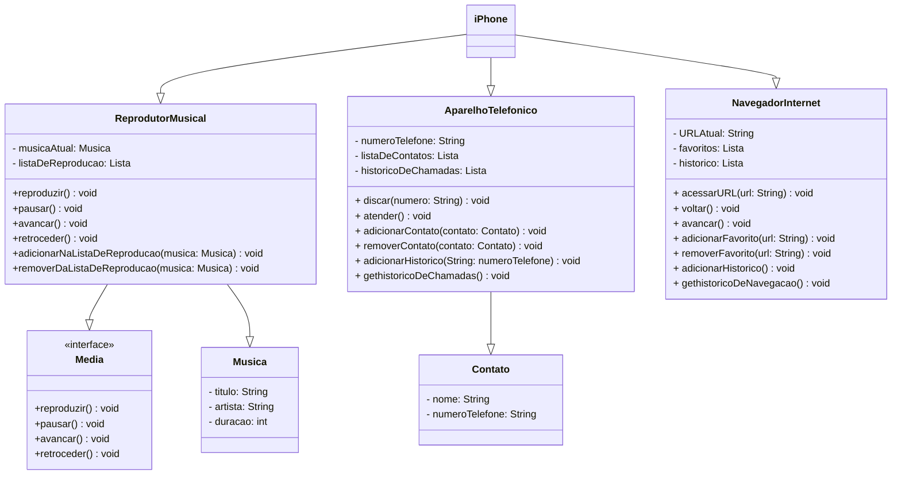

```mermaid
    classDiagram    
    
        class Media{
            <<interface>>
            +reproduzir() void
            +pausar() void
            +avancar() void
            +retroceder() void 
        }
        
        class ReprodutorMusical{
            - musicaAtual: Musica
            - listaDeReproducao: Lista<Musica>
            +reproduzir() void
            +pausar() void
            +avancar() void
            +retroceder() void
            +adicionarNaListaDeReproducao(musica: Musica) void
            +removerDaListaDeReproducao(musica: Musica) void      
        }
    
        class AparelhoTelefonico{
            - numeroTelefone: String
            - listaDeContatos: Lista<Contato>
            - historicoDeChamadas: Lista<String>
    
            + discar(numero: String) void
            + atender() void
            + adicionarContato(contato: Contato) void
            + removerContato(contato: Contato) void
            + adicionarHistorico(String: numeroTelefone) void
            + gethistoricoDeChamadas() void
        }
    
        class NavegadorInternet{
            - URLAtual: String
            - favoritos: Lista<String>
            - historico: Lista<String>
    
            + acessarURL(url: String) void
            + voltar() void
            + avancar() void
            + adicionarFavorito(url: String) void
            + removerFavorito(url: String) void 
            + adicionarHistorico() void
            + gethistoricoDeNavegacao() void
        }
    
        class Musica {
            - titulo: String
            - artista: String
            - duracao: int
        }
    
        class Contato {
            - nome: String
            - numeroTelefone: String
        }
    
        class iPhone{
            
        }
    
        iPhone --|> ReprodutorMusical
        iPhone --|> AparelhoTelefonico
        iPhone --|> NavegadorInternet
        ReprodutorMusical --|> Media
        ReprodutorMusical --|> Musica
        AparelhoTelefonico --|> Contato
```
